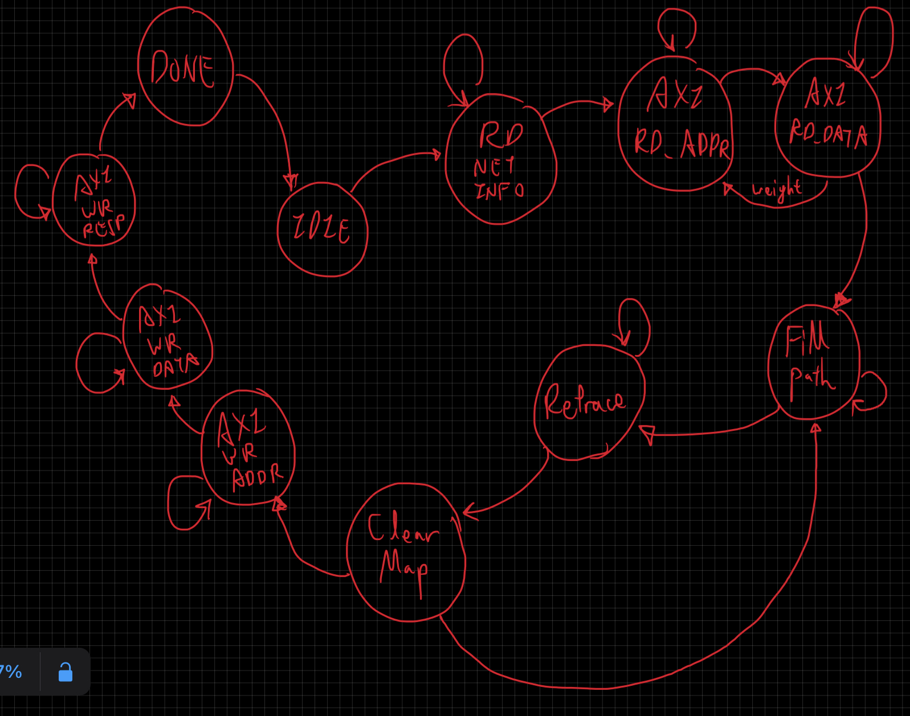

# <strong>
Midterm Project Report
</strong>
### 
IC LAB

### 
312591037 葉舜良 CST

# System Block Diagram

  

# FSM

  

# Optimization method
### Encoding scheme
- Uses 2,2,3,3 encoding scheme to further reduce area when filling the pathmap, since 2 is 2'b10 and 3 is 2'b11 in binary, thus I only needs to use the MSB of the path map to determine whether this slot is path or not.

### Line Buffers
- Uses line buffers to reduce area and critical path of input buffers.

### One-hot encoding scheme
- Increase the speed of the circuit.

